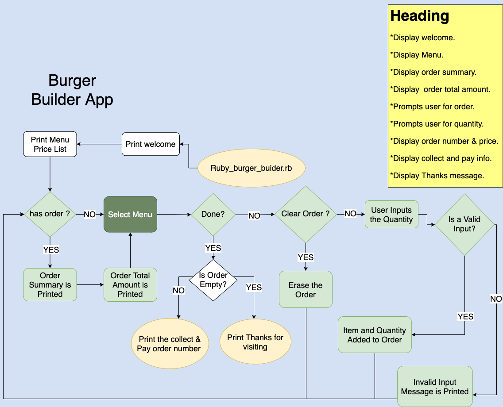

# Burger Builder App

### Question R4 - Provide a link to your source control repository:
### Github Repo Link [Github Repo](https://github.com/Kryptic2020/ruby-burger-builder-app)     
<br>  

### Question R5 - Design a Software Development Plan for a terminal application:
### Description:
-   **The purpose** The Burger Builder App will take online orders of customized burgers, where the user can select a range of ingredients, also the quantity of each selected ingredient.
-   **The problem it will solve:** The App will make the process of ordering a burger more convenient and faster than the conventional in person ordering system as anyone with a smart phone or any other kind of web access can make a order in seconds. Also, having an online platform for the ordering proccess is relatively cheaper, easier, reliable and errorless than having a staff to manage the orders.
-   **Target audience** Any major restaurant and potential customers.  
-   **Usage** The restaurant will insert a list of ingredients with its respective price that will compose the 'Ingredients Menu', the client will be prompted with a Ingredient Menu price list and asked to select an ingredient and its quantity, an order summary and total is displayed above the select menu. This process is repeated until all the desired ingredients is included in the order and the "done" button is clicked. Then the client is prompted to a new screen with message containing the order numer and price for "collect and pay in store".      
<br>   

### Question R6 - Develop a list of features that will be included in the application.
- use of variables and the concept of variable scope
- loops and conditional control structures
- error handling
### Answer:
- Selecting Ingredients or Menu Ingredients: This feature output a single select menu, followed by a "done" option. The single select menu takes the method 'get_ingredients' from the instance menu class as a source of data and display an ordered list of ingredient names, followed by a "done" option and "clear order" option. The method 'get_ingredients' mentioned above exports data extracted from the instantiated menu class variable 'ingredients'. Once one menu item is selected, its value is allocated into a local variable and later included as an argument to the method add_to_order, this step will be explained in more details, at the next feature below. The 'done' option breaks the ordering loop and exit the user from the select menu and display the order number and instructions for collect and pay. The 'clear order" option erase the order items and its quantity.  
- Getting the user input for Ingredient quantity : This feature output a question asking the user to inform the desired quantity for the ordered ingredient, and hit enter (This step is a complement for the step above). The inputed value is then allocated into a local variable and submitted to an error validation where the input is tested to be a number and higher than zero. If it does not pass the validation, an exception is raised and rescued, and an error message notification displayed to the user informing what the correct type of input and conditions it should be, also a loop is actioned returning the user to the input request, so the user is given a chance to give a correct input, the loop brakes when the input is valid and the method add_to_order is called with two arguments, the first one is the selected menu item and second argument is the validated inputed value, and allocates them into a class variable at the Order class instance. 
 - Displaying Order or Order Summary: This feature displays each ordered item and its quantity, taken from the class variable `@order_ingredients`, from the Order class instance. This feature is actioned when the method `display_order` is called. This method is called if the class variable `has_order`, of type Boolean, has a `true` value. Initially this class variable has a value of `false` and it is turned to `true` by a method when the class order receives the first order. The user is kept on the ordering loop until the done option is selected. While in the loop, each time a new order item and its quantity is received by the class variable, the user is prompted back to the select menu and the Order Summary takes the updated data from class variable `@order_ingredients`.
 - Displaying ingredients Price List: This feature list each ingredient and its unit price. This feature is actioned as soon as the `burger` class is instantiated and stays up until the ordering process is finished. This feature takes the class variable `ingredients` as a source of data and is called by the method `display_ingredients`, from the menu class instance.    
 <br>   
 
### Question R7 - Develop an outline of the user interaction and experience for the application.
- how the user will find out how to interact with / use each feature
- how the user will interact with / use each feature
- how errors will be handled by the application and displayed to the user
### Answer:
Each feature displays instructions to help with the interactivity. 
The welcome is the first screen to show up, a big blue box is displayed with "press enter to continue" message, if "enter is pressed, the next screen will show up. 
The next view will be a fixed read only banner with the "Price List".
Below to the price list will be a box with a message  "Which ingredient would you like to add to your Custom Burger?", followed by some instructions as below
-"Select one item to continue or;", an item can be selected and the next step will be displayed. 
-"Select 'Done' to finish shopping or;", if 'done' is selected and there is no order, the current screen is exited and a big green box is displayed with the following message "Thank you for visiting our Burger Builder App!!!", also the system closes. If 'done' is selected and there is order, the current screen is exited and a big yellow box is displayed with the a message containing a generated order number, total price and instructions such as 'Please head to the collect & Pay counter','Inform your order number to proceed with the payment' and 'Collect your order. Enjoy your Custom Burger!.   
-"Select 'Clear Order' to erase the current Order.", if selected, the current Order is erased, the Order summary and total order amount is also erased.(Order summary and total order amount is described at few lines below)
Also, below to it, there is more instructions on how to move the cursor and select the item ('user arrow to move and press Enter').
if an item is selected, a blue box is displayed with the following message "how many 'selected item' would you like followed by instructions 'Please insert the quantity and Enter'. A number higher than zero is expected to be inserted, if a invalid input is inserted (zero, letters or symbols), the following error message will be displayed " 'inputted value' is not a valid input, please insert only numbers greater than zero" and the blue box from the beginning of this step is displayed again and a valid value is requested. If the input pass the validation, the selected item and its quantity is added to the order, a big white box with the total order price with the following info ""Custom Burger Order Price" is displayed above the select menu and a big blue box with order summary containing all selected items and its quantity is displayed above the white box total order price.   
<br> 

### Question R8 - Develop a diagram which describes the control flow of your application. Your diagram must:
- show the workflow/logic and/or integration of the features in your application for each feature.
- utilise a recognised format or set of conventions for a control flow diagram, such as UML.
### Answer:
Please find enclosed the requested flowchart =>   
<br> 

### Question R9 - Develop an implementation plan which:
- outlines how each feature will be implemented and a checklist of tasks for each feature
- prioritise the implementation of different features, or checklist items within a feature
- provide a deadline, duration or other time indicator for each feature or checklist/checklist-item
Utilise a suitable project management platform to track this implementation plan
> Your checklists for each feature should have at least 5 items.
### Answer:
Please refers to the Trello Link => [Trello](https://trello.com/b/fGeWOY6F/burger-builder)
Also, I have included a `docs` folder to the root file containing all trello cards pdf files.  
<br> 

### Question R10 - Design help documentation which includes a set of instructions which accurately describe how to use and install the application.
### You must include:
- steps to install the application
- any dependencies required by the application to operate
- any system/hardware requirements
### Answer:
- Clone the repository from the my github to your local repository => Github Repo Link [Github Repo](https://github.com/Kryptic2020/ruby-burger-builder-app) 
- install bundler for the dependencies management => `$ gem install bundler`
- use bundler to install all required gem dependencies specified on the gemfile - `$ bundle install`
- check for execute permission => `ls -l run.app.sh`
- grant execute permission => `chmod +x run_app.sh`
- on the `src` folder, use `./` as a replacement for the absolute path   ex: `./run_app.sh`
- on the `src` folder, to run the script and start the application, enter `./run_app.sh` on the command line
- list of required dependencies specified on gemfile:
```ruby
gem "rspec", "~> 3.10"
gem "tty-prompt"
gem "tty-box"
gem "colorize"
gem 'artii', '~> 2.1', '>= 2.1.2'
gem 'tty-screen'
gem "tty-table"
```
- Operational System required => windows or Mac os.

